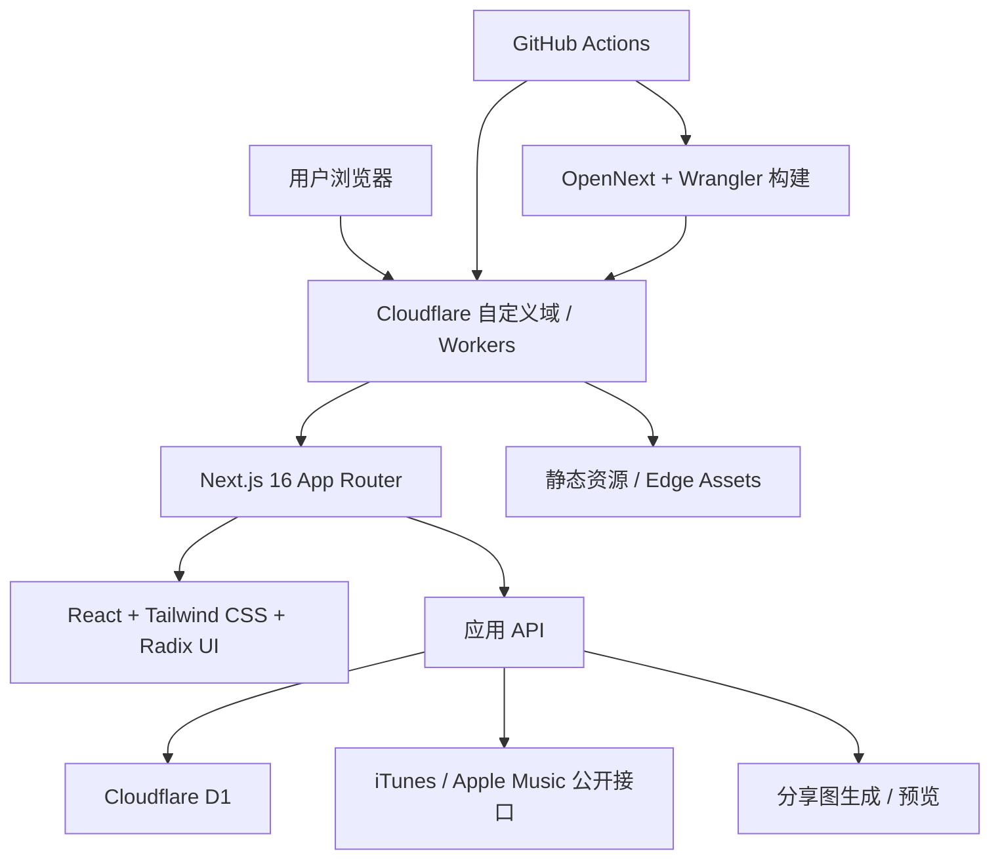

# SongShare

## 简介

SongShare 是一个基于 Next.js 和 Cloudflare Workers 的音乐分享与生成站点，支持歌曲推荐、分享页生成、预览和搜索等功能。

## 演示

<table>
  <tr>
    <td></td>
    <td></td>
    <td></td>
    <td></td>
  </tr>
</table>

- 首页：支持进入歌曲分享与生成流程
- 分享页：可展示已生成的歌曲卡片与相关信息
- 推荐：支持从多地区榜单生成歌曲推荐结果
- 预览：支持在提交前预览生成效果

## 体验地址

- 在线体验：[https://music.songshare.fun](https://music.songshare.fun)

## 架构

- 前端框架：Next.js 16
- 运行平台：Cloudflare Workers + OpenNext
- 存储：Cloudflare D1
- 数据来源：iTunes / Apple Music 相关公开接口
- 构建与部署：Wrangler、GitHub Actions

## 部署说明

### 使用 Codex 部署

> 目标：把当前仓库部署到 Cloudflare，并保持仓库适合开源。
>
> 先阅读 `package.json`、`wrangler.free.jsonc`、`wrangler.jsonc`、`scripts/run-opennext-cloudflare-build.mjs`、`scripts/sync-cloudflare-secrets.mjs` 和 `scripts/verify-cloudflare-access.mjs`，确认这份项目支持两套部署方式：
> - `free`：`workers.dev` + 可选自定义域
> - `production`：自定义域 + D1
>
> 先判断当前要部署的是哪一种。如果关键信息缺失，先向我确认，不要自行猜测。你可能需要我手动提供这些值：
> - Cloudflare `account_id`
> - 目标 `zone_name`
> - 目标域名或子域名，例如生产域或测试域
> - 目标环境：`free` / `production` / `test`
> - 对应环境的 `D1 database_id`
> - 是否启用 `NEXT_PUBLIC_GA_ID`
> - 是否启用表单或收款等可选外链配置
> - 站点公开访问地址 `SITE_URL`
>
> 执行顺序请按下面做：
> 1. 检查仓库里是否仍然存在示例域名、示例 D1 ID 或其他占位值。
> 2. 如果需要，把配置替换为用户给定的真实值，但不要把任何秘密写回公开文档。
> 3. 运行构建和校验命令，确认本地能编译通过。
> 4. 如需部署，先同步 Cloudflare secrets，再执行部署。
> 5. 如果是自定义域部署，确认 `wrangler` 路由和实际 zone 绑定一致。
> 6. 如果现有 DNS 记录会阻止自定义域切换，要先提示我处理，不要静默覆盖。
>
> 完成后请返回：
> - 本次采用的部署模式
> - 需要我手动补充的配置项
> - 已完成的构建与部署结果
> - 最终访问地址

### 使用 Claude Code 部署

> 目标：把当前仓库部署到 Cloudflare，并保持仓库适合开源。
>
> 先阅读 `package.json`、`wrangler.free.jsonc`、`wrangler.jsonc`、`scripts/run-opennext-cloudflare-build.mjs`、`scripts/sync-cloudflare-secrets.mjs` 和 `scripts/verify-cloudflare-access.mjs`，确认项目支持 `free`、`test`、`production` 三种上下文。
>
> 在开始改动前，先确认以下信息是否已经提供：
> - Cloudflare `account_id`
> - Cloudflare `zone_name`
> - 目标部署环境
> - 对应的 `D1 database_id`
> - 站点公开地址 `SITE_URL`
> - 是否启用 `NEXT_PUBLIC_GA_ID`
> - 是否启用其他可选外链配置
>
> 如果这些信息不完整，先列出缺失项并等待确认。不要使用仓库里的示例域名、示例 D1 ID 或占位值作为真实配置。
>
> 按这个顺序执行：
> 1. 校验 `wrangler` 配置和脚本引用是否与目标环境一致。
> 2. 如有必要，更新 `SITE_URL`、`NEXT_PUBLIC_SITE_URL` 和相关部署配置。
> 3. 运行构建与 lint，确认项目可以正常通过。
> 4. 如需部署，先同步 Cloudflare secrets，再发布 Worker。
> 5. 检查部署后的自定义域、D1 绑定和公开访问是否正常。
>
> 输出时请只给我：
> - 你采用的部署路径
> - 你向我确认过的配置
> - 你实际执行过的命令结果
> - 最终部署地址和任何遗留手动步骤

### 说明

- 这份仓库默认面向 Cloudflare Workers + D1 部署
- 如果走 `free` 路径，通常使用 `workers.dev`
- 如果走 `production` 路径，需要准备自定义域、zone 和对应的 D1 绑定
- 部署前需要准备好 Cloudflare 账号权限、D1 数据库和必要的环境变量
- 可选配置包括分析、表单、收款和站点公开地址
- 如果是公开仓库，请确保 `wrangler` 配置和文档里只保留示例值或脱敏值

## 致谢

本项目基于 [SomiaWhiteRing/my9](https://github.com/SomiaWhiteRing/my9) 进行二次开发，感谢原项目的基础设计与实现。
